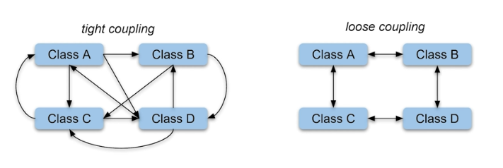
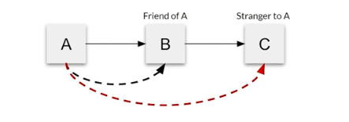

## What are the hallmarks of good architecture?

1. **Loose Coupling** - weak knowledge association between components.
2. **Separation of Concerns** - breaking you architecture into tiers.
3. **Law of Demeter (LoD)**
4. **SOLID** Principles of object-oriented programming.

#### Loose Coupling

Changes to one component least affect the existence of performance of another component.

#### Separation of Concerns

The separation of Concerns is achieved using modularization, encapsulation, and arrangement in software layers.

#### Law of Demeter (LoD)
a. Each unit should have only limited knowledge about other units: it should only know about units "closely" related to itself. 
b. Each unit should only talk to its friends; don't talk to strangers. 
c. Only talk to your immediate friends. 

A given object should assume as little as possible about the structures and properties of anything else. It is also known as **Principle of Least Knowledge**.

#### SOLID

1. Single responsibility principle
2. Open Closed principle
3. Liskov substitution principle
4. Interface segregation principle
5. Dependency inversion principle
